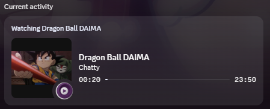
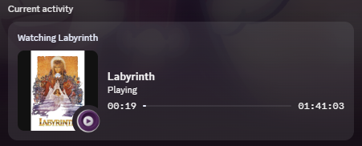

# discord-mpv-rpc

<p align="center">
  <a href="https://discord.com/"></a>&nbsp;&nbsp;&nbsp;&nbsp;
  <a href="https://www.themoviedb.org/"></a>
</p>

Discord Rich Presence for [mpv](https://mpv.io/) with optional movie/TV artwork and episode metadata from [TMDb](https://www.themoviedb.org/).

The script publishes the current media title to Discord as **Watching `<title>`**, shows play/pause/idle state with optional small assets, and uses Discord timestamps for the playback progress bar. When a TMDb API key is configured, it can resolve movie/TV titles from release filenames, use TMDb artwork as the large image, and display numbered TV episode titles and stills when TMDb has the requested episode, including the season total when available.

Presence updates are event-driven. There is no periodic elapsed/remaining-time text refresh; Discord animates the progress bar from the timestamps it already has.

## Preview

<p align="center">
  
  
</p>

<p align="center">
  <em>Examples of discord-mpv-rpc displaying an anime episode and a movie in Discord.</em>
</p>

> Movie/TV metadata and artwork are provided by TMDb. Discord is a trademark of Discord Inc. This project is not affiliated with or endorsed by Discord or TMDb.

## Features

- **Watching `<title>`** Rich Presence instead of the Discord Developer Portal application name
- Title preference:
  1. official TMDb title
  2. file `metadata/title`
  3. cleaned filename
  4. mpv `media-title`
- Event-driven Discord updates on file load, pause/resume, buffering, speed/duration changes, seek/playback restart, chapter changes, idle state, and TMDb result arrival
- Speed-aware Discord progress bar while playing, with timestamps removed while paused or buffering
- Numbered TMDb episode titles on the state line: `04 of 20: Chatty`, or `04: Chatty` when the season total is unavailable
- Meaningful chapter titles when no TMDb episode title is available
- Optional play / pause / idle small-image assets
- Optional TMDb movie/TV artwork via asynchronous `curl`
- TV episode stills when the filename contains a recognized season/episode
- Clickable TMDb links on the title/state/large image
- Staged TV search with year-aware matching, directory context, original titles, and alternate-title fallback
- Exact TMDb episode lookup only — the script does **not** remap a missing season/episode to another TMDb season
- Filename parsing for common movie, TV, scene, and anime naming patterns
- Case-insensitive cleanup of stacked release tags, codec/audio details, and recognized release groups before TMDb matching
- Parent-directory year/title context for folders such as `Show Name (2026)`
- Persistent show, episode, and season-count cache across mpv sessions
- Bounded in-memory request/alias/parser caches
- TMDb request pacing, request coalescing, stale-request cancellation, and 429 backoff
- Optional square/letterboxed poster rendering through [wsrv.nl](https://wsrv.nl/), with automatic fallback to the raw TMDb image
- Automatic Discord IPC reconnect with exponential backoff
- Toggle Rich Presence on/off with a key binding (default: `D`)
- Supports standard mpv config directories and `portable_config`

## Requirements

- [mpv](https://mpv.io/)
- Discord desktop app running
- [`curl`](https://curl.se/) on `PATH` if using TMDb artwork/metadata
- Optional: a free [TMDb API key](https://www.themoviedb.org/settings/api)

LuaJIT is recommended. On Windows, LuaJIT is required for the background IPC reader and disconnect detection. The non-LuaJIT Windows fallback can still send presence, but cannot read incoming messages in the background; disconnects may only be noticed on a later send. The script logs this limitation.

On Unix-like systems without LuaJIT, the fallback Discord IPC transport requires LuaSocket with `socket.unix`; that transport supports background reads.

You do **not** need a Discord bot, OAuth flow, or install link.

## Installation

Install the script in its own subdirectory under mpv's `scripts/` directory. The persistent cache is stored next to the script.

### Standard config

Copy `main.lua` and the entire **`modules/`, `db/`, and `tools/` folders** into `scripts/discord-mpv-rpc/`, preserving the folder structure. Keep implementation modules inside `modules/` and data tables inside `db/`.

Place `main.lua` at:

| OS | Script path |
|---|---|
| Windows | `%APPDATA%\mpv\scripts\discord-mpv-rpc\main.lua` |
| Linux / macOS | `~/.config/mpv/scripts/discord-mpv-rpc/main.lua` |

Copy `discord-mpv-rpc.conf` to:

| OS | Config path |
|---|---|
| Windows | `%APPDATA%\mpv\script-opts\discord-mpv-rpc.conf` |
| Linux / macOS | `~/.config/mpv/script-opts/discord-mpv-rpc.conf` |

### Portable config

If `portable_config` is next to `mpv.exe`:

| File | Portable installation path |
|---|---|
| Script | `<mpv_dir>\portable_config\scripts\discord-mpv-rpc\main.lua` |
| Config | `<mpv_dir>\portable_config\script-opts\discord-mpv-rpc.conf` |

mpv will auto-load `scripts/discord-mpv-rpc/main.lua`. For portable installations, place the `modules/`, `db/`, and `tools/` folders beside `main.lua` as well. Keep your existing `discord-mpv-rpc.conf`; its options are unchanged.

### Source layout

Each module is a factory with explicit dependencies. Private implementation state stays local; the small shared state table keeps current metadata, cancellation, cache ownership, and the presence callback synchronized. `main.lua` loads dependencies before registering playback events.

| File | Responsibility |
|---|---|
| `main.lua` | Load modules and create per-script shared state |
| `modules/database.lua` | Load local parsing rules |
| `modules/tmdb_index.lua` | Optional disk-backed TMDb title index |
| `tools/update_tmdb_index.lua` | Background validation and conditional DB rebuild |
| `tools/index_health.lua` | Manifest age, integrity checks, and checksums |
| `tools/index_platform.lua` | LuaJIT OS directory creation, locking, and executable discovery |
| `db/parsing_keywords.lua` | Release suffix patterns and group prefixes |
| `modules/config.lua` | Defaults, user options, platform constants |
| `modules/helpers.lua` | Logging, UTF-8 truncation, paths, memory-cache trimming |
| `modules/cache.lua` | Persistent poster cache, expiry, deferred saves |
| `modules/http.lua` | curl requests, coroutine execution, URL encoding |
| `modules/artwork.lua` | Poster fitting and wsrv availability/fallback |
| `modules/filename.lua` | Release-tag cleanup, title/year/episode parsing, chapter titles |
| `modules/tmdb_requests.lua` | Request caching, coalescing, cancellation, pacing and backoff |
| `modules/tmdb.lua` | Candidate scoring, aliases, searches and episode metadata |
| `modules/metadata.lua` | Active-file lookup and current display metadata |
| `modules/ipc.lua` | Discord framing, platform transports, handshake and protocol |
| `modules/presence.lua` | Activity formatting, timestamps, reconnects and mpv events |

## Discord application setup

The script uses the built-in Application ID by default. Leave `client_id=` empty or omit it to use this default; creating your own Discord application is optional.

In Discord, enable **Settings → Activity Privacy → Display current activity as a status message**.

### Optional custom Application ID

1. Open the [Discord Developer Portal](https://discord.com/developers/applications).
2. Create a **New Application**.
3. Open **General Information** and copy the **Application ID**.
4. Set `client_id=YOUR_APPLICATION_ID` in `discord-mpv-rpc.conf` and restart mpv.

### Optional Discord art assets

If you use a custom Application ID, under your Discord application's **Rich Presence → Art Assets**, you can upload square images matching the configured fallback/small-image keys:

- `mpv`
- `play`
- `pause`

These names are configurable. TMDb artwork is loaded remotely and does not need to be uploaded to the Developer Portal.

## TMDb setup

1. Create/get a TMDb API key from [TMDb API settings](https://www.themoviedb.org/settings/api).
2. Set it in:

```ini
tmdb_api_key=your_tmdb_key_here
```

Leave `tmdb_api_key=` empty if you only want Discord Rich Presence without TMDb lookup.

## Configuration

All options live in `script-opts/discord-mpv-rpc.conf`. Edit this file before starting mpv; restart mpv after configuration changes.

`update_interval` has no effect and is not included in the sample configuration. The IPC reader interval and reconnect timing are internal constants, not presence-refresh options.

| Option | Default | Description |
|---|---|---|
| `client_id` | Built-in application | Discord Application ID. Empty or omitted uses the built-in default; set a custom ID to override |
| `tmdb_api_key` | empty | TMDb API key. Leave empty to disable TMDb lookups |
| `tmdb_language` | `en-US` | TMDb language used for searches and metadata |
| `tmdb_episode_lookup` | `yes` | Look up exact TMDb TV episode titles/stills and season totals when season/episode information is parsed |
| `key_toggle` | `D` | Key binding used to enable/disable Rich Presence |
| `large_image` | `mpv` | Fallback Discord large-image asset key |
| `large_text` | `mpv` | Hover text for the fallback large image |
| `small_image_playing` | `play` | Small-image asset while playing |
| `small_image_paused` | `pause` | Small-image asset while paused or buffering |
| `small_image_idle` | `mpv` | Small-image asset while idle |
| `poster_fit` | `contain` | `contain` letterboxes TMDb artwork to a square through wsrv.nl; `raw` sends the original TMDb image URL directly |
| `enabled` | `yes` | Start with Rich Presence enabled |

Example:

```ini
client_id=
tmdb_api_key=your_tmdb_key_here
tmdb_language=en-US
tmdb_episode_lookup=yes

key_toggle=D
large_image=mpv
large_text=mpv
small_image_playing=play
small_image_paused=pause
small_image_idle=mpv

poster_fit=contain
enabled=yes
```


## Rich Presence behavior

### Title and state

The Discord title is chosen in this order:

1. TMDb official title
2. File `metadata/title`
3. Cleaned filename
4. mpv `media-title`

The state line uses:

1. TMDb episode title formatted as `<episode number> of <season total>: <episode title>`, or `<episode number>: <episode title>` when the total is unavailable
2. Meaningful chapter title
3. Playing / Paused / Idle

Episode numbers are padded to at least two digits (`03`, `04`, `104`). The total is the number of episodes TMDb lists for the requested season, not the entire series. It is omitted if unavailable or smaller than the current episode number. The episode title comes from TMDb in the configured language, even when the filename contains a different title.

For example, with a season total of 20:

```text
Dragon Ball DAIMA
04 of 20: Chatty
```

When the total is unavailable, the same episode displays:

```text
Dragon Ball DAIMA
04: Chatty
```

Cached episode titles use the same formatting automatically; no cache reset is needed.

Generic chapter labels and timestamp-only chapter names are filtered out. When an episode or chapter title occupies the state line, the optional small-image badge conveys playback state. Cache buffering uses the paused badge/label. Outgoing title, state, and large-image hover text are shortened at UTF-8 boundaries when they exceed 120 bytes.

### Progress bar

While playing, the script sends Discord `start` and `end` timestamps calculated from mpv's current position, duration, and playback speed. Discord animates the progress bar locally after that. At 2× speed, for example, 10 minutes of remaining media correspond to 5 minutes of remaining wall-clock time.

The timestamp calculation is `start = now - position / speed` and `end = now + (duration - position) / speed`, rounded down to whole seconds. This preserves the progress fraction and expected finish time; timestamps represent wall-clock playback time rather than literal media time at non-1× speeds.

There is **no periodic elapsed/remaining-time text update**.

When paused or waiting for the playback cache, timestamps are removed so progress does not continue advancing. On resume, buffering completion, seek/playback restart, or speed/duration change, timestamps are recalculated and sent again. Idle playback and media without a known positive duration have no progress timestamps.

### Event-driven updates

Presence is refreshed only when something meaningful changes, including:

- file loaded
- TMDb/poster/episode result arrived
- pause or resume
- buffering starts or ends
- playback speed or duration changes
- seek / playback restart
- chapter change when no TMDb episode title is active
- idle state change
- Discord reconnect
- manual enable/disable

Seek/restart events are debounced to reduce Discord IPC updates while scrubbing. Metadata-only callbacks skip sending when the visible activity is unchanged. Background IPC reads do not periodically republish the activity.

## Filename parsing

The parser recognizes several common TV/anime patterns, including forms such as:

```text
Show.Name.S02E05.mkv
Show Name S02 E05.mkv
Show Name S2 - 03.mkv
Show.Name.2x05.mkv
Show Name Season 2 Episode 5.mkv
Show Name Season 2 Ep 5.mkv
Show Name - 05 - Episode Title.mkv
Show Name - 05 (1080p).mkv
Show Name - 05v2.mkv
```

Movie filenames can use common year forms such as:

```text
Movie Name (2026).mkv
Movie.Name.2026.1080p.BluRay.mkv
```

### Release-tag cleanup

Before TMDb matching, the script removes square-bracketed metadata and recognized trailing release tags. Tag matching is case-insensitive and repeats until stacked tags have been removed. Dots and underscores in the derived title become spaces; year and episode markers are parsed separately from the search title.

| Type | Examples removed |
|---|---|
| Source / release format | `WEBDL`, `WEB-DL`, `WEBRip`, `BluRay`, `Blu-Ray`, `BRRip`, `BDRip`, `HDRip`, `DVDRip`, `HDTV`, `REMUX` |
| Resolution | `480p`, `576p`, `720p`, `1080p`, `2160p`, `4320p`, their `i` variants, `2K`, `4K`, `8K` |
| Video codec / bit depth | `h264`, `H.264`, `x264`, `x265`, `HEVC`, `AVC`, `AV1`, `8bit`, `10bit`, `12bit` |
| Audio | `EAC3`, `E-AC3`, `AC3`, `AAC`, `DTS`, `DTS-HD`, `TrueHD`, `DDP`, `Atmos`, `FLAC`, `Opus`, `MP3`, channel layouts such as `5.1` and `7.1.4` |
| Other technical / release tags | `HDR`, `HDR10`, `HDR10+`, `SDR`, `PROPER`, `REPACK`, `AMZN`, `NF`, `DSNP`, `HMAX` |
| Recognized release groups | `Judas`, `SubsPlease`, `HorribleSubs` |

Square-bracketed groups such as `[Judas]` are removed wherever they occur. Recognized unbracketed groups are removed at the end, or at the start when followed by a dash, such as `Judas - Movie`. A bare group name at the start without a dash is preserved to avoid damaging titles such as `Judas and the Black Messiah`. Technical tags are removed at the end of the filename or derived title, rather than from arbitrary words inside a title.

Release metadata is also stripped before episode detection, so `Show - 04 [1080p]` and `Show - 04v2 1080p x265 10bit` can be recognized as season 1, episode 4. This cleanup changes the search text; it does not rename media files.

Examples of parsed filenames:

| Input | Parsed result |
|---|---|
| `1984 (2023).mkv` | Title `1984`, year `2023` |
| `Movie.1080p.WEB-DL.x265.AAC.mkv` | Title `Movie` |
| `Movie.WEBDL.1080p.EAC3.h264-Judas.mkv` | Title `Movie` |
| `Movie.bLuRaY.x264.x265.10bit-SubsPlease.mkv` | Title `Movie` |
| `[HorribleSubs] Show - 04v2 1080p EAC3 5.1 x265 10bit.mkv` | Title `Show`, season 1, episode 4 |
| `[Judas] Dragon Ball Daima - S01E04v2.mkv` | Title `Dragon Ball Daima`, season 1, episode 4 |
| `[SubsPlease] Show - 04 [1080p].mkv` | Title `Show`, season 1, episode 4 |
| `Show.Name.(2026)/Show.S01E02.mkv` | Title `Show`, year `2026`, season 1, episode 2 |

Filename parsing remains heuristic; unknown unbracketed release groups and unusual naming conventions can still need manual cleanup. Parsed titles are search inputs; the displayed title uses the official TMDb title when a match is found.

When useful, the script can also inherit title/year context from a parent directory containing a year, for example:

`Show Name (2026)/Show Name - S01E02.mkv`

## TMDb matching

TMDb matching is designed to avoid unnecessary requests while still handling localized, romanized, rebooted, and alternate-title releases.

### TV shows

TV resolution is staged:

1. Search `/search/tv` using the filename-derived title and known year when available.
2. If the result is not decisive and directory title context differs, search that title using the known year.
3. If still needed, broaden the TV searches without the year filter.
4. Use `/search/multi` as an additional candidate source when the earlier stages remain weak/ambiguous.
5. Only difficult matches fan out into alternate-title requests.
6. Alternate-title checks are tiered:
   - exact-year candidates first
   - strongest broader candidates next
   - full deduplicated candidate pool only as a final fallback

Candidates are scored using title similarity, original/official titles, alternate titles when needed, media type, year, and poster availability.

This allows a release name to match a TMDb series even when TMDb's primary English title is different.

### Movies

Movies use TMDb multi-search and the same confidence-based title/year/media-type scoring.

### TV episodes

If a filename resolves to a TV show and contains a season/episode, the script requests exactly:

```text
/tv/<show-id>/season/<season>/episode/<episode>
```

The returned `season_number` and `episode_number` must match the requested values.

When an episode title is available, the script also requests `/tv/<show-id>/season/<season>` if the season count is not cached or has expired. The returned season must match the requested season; its episode list supplies the total. A missing or failed season-count lookup leaves the episode number and title visible without `of <season total>`.

If TMDb does not currently have that exact season/episode, the script stops there. It does **not** guess, shift, or map the episode to another season.

Set:

```ini
tmdb_episode_lookup=no
```

to disable episode lookup entirely.

## Posters and `poster_fit`

### `poster_fit=contain`

Discord displays large artwork in a square area, which can crop portrait posters. With `poster_fit=contain`, the script sends the TMDb artwork through wsrv.nl to create a 512×512 contained image with letterboxing.

The script probes wsrv availability with a lightweight GET whose image body is discarded:

- success is remembered for 24 hours
- failure is remembered for 10 minutes
- recent global wsrv health is persisted across mpv sessions
- if wsrv is unavailable, the raw TMDb image URL is used instead

### `poster_fit=raw`

The raw TMDb image URL is sent directly to Discord. wsrv.nl is not used.

> **Privacy/network note:** `poster_fit=contain` sends the TMDb image URL to wsrv.nl so it can proxy/resize the image. Use `poster_fit=raw` if you do not want to use that third-party image proxy.

## Cache

The persistent cache is stored next to `main.lua` as:

```text
discord-mpv-rpc-posters.json
```

| Mode | Cache path |
|---|---|
| Standard Windows | `%APPDATA%\mpv\scripts\discord-mpv-rpc\discord-mpv-rpc-posters.json` |
| Standard Linux/macOS | `~/.config/mpv/scripts/discord-mpv-rpc/discord-mpv-rpc-posters.json` |
| Portable | `<mpv_dir>\portable_config\scripts\discord-mpv-rpc\discord-mpv-rpc-posters.json` |

### Persistent entries

Show cache keys distinguish media type:

```text
show:tv|<normalized title>|<year>|<language>
show:movie|<normalized title>|<year>|<language>
```

Episode entries use the resolved TMDb show ID:

```text
episode:<tmdb show id>:SxxExx:<language>
```

Season counts use the resolved TMDb show ID and requested season:

```text
season-count:<tmdb show id>:Sxx
```

The persistent cache stores compact data used by Discord, such as:

- TMDb ID/media type
- official title
- poster/still URL
- TMDb page URL
- raw episode name when available; the number and total are added for display
- episode count for the requested season when available

Other behavior:

- show misses expire after 7 days
- exact episode 404s expire after 24 hours
- season counts expire after 24 hours and are refreshed on a subsequent lookup
- unavailable season counts are cached for one hour before a subsequent lookup retries
- expired entries are pruned on cache load/save
- cache size is bounded to 1000 entries
- writes are deferred briefly to reduce disk churn
- cache writes use a process-specific temporary file, `discord-mpv-rpc-posters.json.<pid>.tmp`
- write, flush, and close must succeed before the temporary file replaces the main JSON file
- failed replacement retains the complete temporary file and logs its path; on Windows, replacement may require removing the existing file before renaming
- incomplete searches, including alias-request failures, are not persisted as seven-day misses
- valid persistent cache hits remain available during HTTP backoff
- successful show/episode entries have no age-based expiry; clear the cache manually when retesting corrected metadata

Close mpv, delete `discord-mpv-rpc-posters.json`, then restart mpv to force a fresh lookup. Deleting the file while mpv is running does not clear its in-memory entries.

### In-memory caches

discord-mpv-rpc also keeps bounded process-local caches for reusable data:

- TMDb search responses: up to 512 entries, 24-hour TTL
- TMDb alternate titles: up to 256 entries, 30-day TTL
- parsed filenames: up to 256 entries
- wsrv per-URL status: up to 256 entries

Episode, season-count, and alternate-title lookups retain compact results without duplicating their raw JSON in the generic TMDb response cache.

## Network/request behavior

TMDb requests are designed to stay conservative during normal playback:

- new TMDb HTTP requests are paced at least 250 ms apart
- identical simultaneous TMDb requests are coalesced
- reusable search responses are cached in memory
- persistent show results prevent rediscovering the same show for every episode
- switching files invalidates stale lookup work
- active stale TMDb `curl` subprocesses are aborted when possible
- HTTP 429 triggers exponential backoff from 30 seconds up to 5 minutes
- request failures prevent an incomplete lookup from being stored as a normal "no result" match
- backoff suppresses HTTP requests, not reads from the persistent cache

With the show and a valid season count cached, another uncached episode of the same season normally needs only the exact episode request. A missing or expired season-count entry adds a season-details request when an episode title is available. Cached episode titles may also trigger that count lookup; the title itself does not need to be fetched again.

Discord Rich Presence traffic uses local IPC and is separate from TMDb/wsrv HTTP traffic.

## Discord IPC and reconnects

The script communicates directly with the Discord desktop client's IPC socket/named pipe.

It includes:

- A background reader every 250 ms while connected, on LuaJIT transports and the Unix LuaSocket fallback
- Nonblocking reads that buffer fragmented headers and payloads
- Frame length/opcode validation, a 1 MiB payload limit, and a 5-second timeout for incomplete incoming frames
- Ping/pong handling, close-frame detection, and RPC error logging with the response nonce
- UTF-8 → UTF-16 handling on Windows
- Reconnect backoff from 1 to 30 seconds, checked by a one-second watchdog while disconnected
- Automatic republishing of the current activity after a successful reconnect
- Explicit JSON `null` when clearing activity; toggling off also closes the connection and stops its reader

The normal presence engine does not periodically resend activity. The reader checks incoming local IPC data; the reconnect watchdog only runs while disconnected. These are separate from TMDb/wsrv HTTP requests.

On Windows without LuaJIT, the fallback lacks background reads. Automatic detection during otherwise unchanged playback therefore requires a LuaJIT-enabled mpv build.

## Usage

1. Start Discord.
2. Start mpv and play a file.
3. Rich Presence should appear after connection/metadata resolution.
4. Press `D` (or your configured `key_toggle`) to turn Rich Presence on/off.

Useful log messages include:

```text
discord-mpv-rpc: connected to Discord
discord-mpv-rpc: cleaned title="..." year=... tv=... S...E...
discord-mpv-rpc: TMDb selected id=... type=tv title="..." year=... score=...
discord-mpv-rpc: poster -> https://image.tmdb.org/...
discord-mpv-rpc: episode -> ...
discord-mpv-rpc: poster cache hit -> ...
```

Run mpv from a terminal or enable verbose logging when troubleshooting title matching.

## Troubleshooting

| Problem | What to check |
|---|---|
| No Discord status | Discord desktop is running; `client_id` is correct; Activity Privacy is enabled |
| `handshake not READY` | Verify the Discord Application ID; restart Discord if necessary |
| Discord was started/restarted after mpv | Supported readers detect the disconnect and reconnect automatically; Windows background detection requires LuaJIT |
| `LuaJIT is required on Windows for background IPC disconnect detection` | Use a LuaJIT-enabled mpv build for background IPC reads |
| `Discord RPC error (nonce=...)` | Inspect the logged Discord error message; a successful local write alone does not mean Discord accepted the activity |
| Changing `update_interval` does nothing | This option is ignored; presence is event-driven |
| No TMDb artwork | `tmdb_api_key` is set; `curl` is available on `PATH`; inspect the cleaned-title/TMDb log lines |
| Wrong movie/show | Inspect `cleaned title=...` and `TMDb selected id=...`; remove the persistent cache when deliberately retesting from a clean state |
| Correct show but no episode title/still | TMDb may not contain that exact season/episode yet. discord-mpv-rpc intentionally does not remap it to a different season |
| Episode title appears without `of <season total>` | The season count is unavailable or smaller than the current episode number. Unavailable counts are retried on a subsequent lookup after one hour |
| Do not want episode lookups | Set `tmdb_episode_lookup=no` |
| Poster is cropped | Use `poster_fit=contain` |
| Do not want wsrv.nl | Use `poster_fit=raw` |
| wsrv is unavailable | The script falls back after a failed probe; a later poster lookup can probe again after the failure TTL expires |
| TMDb returns 429 | The script automatically backs off; avoid repeatedly deleting the cache during normal use |
| Old cached result during testing | Close mpv, delete `discord-mpv-rpc-posters.json`, and restart so disk and process-local caches are cleared |

### Test TMDb manually

Example TV search:

```bash
curl -s "https://api.themoviedb.org/3/search/tv?api_key=YOUR_KEY&query=Dragon%20Ball%20DAIMA"
```

If that fails outside mpv, check your TMDb key, network access, and `curl` installation.

## Notes

- TMDb episode lookup is intentionally conservative. Missing TMDb data is left missing rather than guessed.
- Title matching is cached, so later episodes of the same show normally avoid repeating the full search process.
- The Discord progress bar is driven by timestamps; the script does not display elapsed/remaining time text.

## License

[MIT](https://opensource.org/licenses/MIT)

## Optional local TMDb export index

The included snapshot is dated **2026-09-07** and contains **1,017,532 movie** and **219,456 TV title keys**. It is checked automatically before use.

The optional index uses [TMDb daily movie and TV exports](https://developer.themoviedb.org/docs/daily-id-exports).
It indexes the available original titles and preserves duplicate IDs. It is not
an English/Japanese synonym database. Local candidates are verified through
TMDb detail requests for title, year, media type, and artwork. Your TMDb API key
is still required for metadata. Episode lookups retain exact season/episode
numbering.

Install `main.lua`, `modules/`, `db/`, and the entire `tools/` folder together. All updater code is Lua, running
inside mpv. It uses the existing curl executable for HTTPS downloads and mpv's
JSON functions. Gzip decompression and sorting are bundled Lua code; no separate
language runtime, database engine, or unzip program is required.

DB search and automatic maintenance are enabled by default. On startup and
hourly thereafter, a detached mpv worker validates the index. **It downloads
and builds only if the DB is missing, corrupted, or its export date is at least
seven days old**, measured from the export date at midnight UTC. A healthy,
newer DB is checked without downloading or rebuilding. Checksums cover the
index and offset files, including accidental edits that do not change file size.
Older manifests without checksums receive structural record validation.

While validation or rebuilding runs, cached metadata and online TMDb searches
remain available. Invalid and week-old indexes are not used. A completed DB is
picked up automatically (normally within a minute), and current-file metadata
is refreshed; no restart is needed. The required parsing keyword table is
separate from the optional downloaded DB.

Automatic setup and locking require **mpv built with LuaJIT** on Windows,
Linux, or macOS. The Lua updater calls native OS filesystem functions through
LuaJIT; no extra executable is needed beyond mpv and the existing curl.
Missing `db/tmdb/` directories are created automatically. An OS lock allows
only one updater for the folder; it is released even if that process exits
unexpectedly. Failed attempts are retried no more than once per hour, including
across player restarts. Read-only script installations must be made writable
for automatic builds; online search continues if maintenance cannot run.

For manual maintenance, run the following from the installed folder. It applies
the same age/integrity gate, so a healthy DB less than a week old is left alone:

```sh
mpv --no-config --load-scripts=no --idle=yes --vo=null --ao=null --script=tools/update_tmdb_index.lua
```

The updater exits with status 0 on success, 1 on failure. It does not start
playback or load the Rich Presence script. The default export date is yesterday
UTC. An explicit date can be supplied with:

```sh
mpv --no-config --load-scripts=no --idle=yes --vo=null --ao=null --script=tools/update_tmdb_index.lua --script-opts=tmdb-index-date=2026-09-07
```

To supply local compressed exports when a rebuild is needed:

```sh
mpv --no-config --load-scripts=no --idle=yes --vo=null --ao=null --script=tools/update_tmdb_index.lua --script-opts="tmdb-index-date=2026-09-07,tmdb-index-movie_export=movie_ids_09_07_2026.json.gz,tmdb-index-tv_export=tv_series_ids_09_07_2026.json.gz"
```

Use the actual exports' date. TMDb normally publishes exports by 08:00 UTC and
retains them for three months. All downloads and generated files stay in
`db/tmdb/`. The updater validates gzip checksums and the expected export fields.
It sorts in bounded batches and merges temporary files using Lua. Decompression
still holds one complete export in memory, so updating is much heavier than
playback; allow several hundred MB of free memory and time for a full rebuild.
Run heavy rebuilds with enough free memory for one decompressed export.

No OS scheduled task is installed. Background maintenance runs while the
script is enabled in mpv; a worker already started may finish after the player
closes or DB lookup is toggled off. New snapshots use generation-prefixed filenames; the included
snapshot's folder layout remains supported. A failed build leaves the active
snapshot unchanged. On Windows, publication may briefly move the old pointer
to `current.json.bak`; the reader can use that backup if the current pointer is
missing. Old snapshot files are retained for running readers. Remove unused
snapshots only after closing all mpv instances.

The bundled [LibDeflate](https://github.com/SafeteeWoW/LibDeflate) provides pure
Lua DEFLATE decompression. Its original zlib license and attribution are retained
in `tools/vendor/LibDeflate.lua`. The gzip wrapper, checksum checks, and index
builder are in `tools/gzip.lua` and `tools/index_builder.lua`.

The Lua reader performs bounded disk lookups, rather than loading/scanning the
full exports during playback. Titles with more than four candidate IDs use
normal online search. A shortcut requires one verified, exact-title candidate,
with an exact year when supplied. Ambiguous results, missing indexes, corrupt
records, and snapshots at least seven days old fall back to the existing TMDb search.
The existing TMDb request cache, pacing, cancellation, and backoff remain active.
The index may save search requests for unique exact titles; duplicate-title
verification can require additional requests.

To disable both DB lookup and automatic maintenance, add this to your existing script options file:

```ini
tmdb_local_index=no
```

Set `tmdb_local_index=yes` to enable both. Press **Ctrl+D** to toggle them for
the current mpv session (the configuration file is not rewritten). This does
not stop a detached build already in progress. The existing `D` key still
toggles Rich Presence itself. Customize or disable the DB shortcut with
`key_toggle_db=Ctrl+d` or `key_toggle_db=`. You can also send
`script-message discord-mpv-rpc-toggle-db`.

The script normally discovers the running mpv executable. If an embedded or
unusual installation needs an explicit worker executable, set
`tmdb_index_mpv_path` to the full path of a LuaJIT-enabled mpv executable.


## Local parsing rules

`db/parsing_keywords.lua` contains the existing release suffix patterns and
release group prefixes. Tables are loaded once; restart mpv after editing.
`release_suffixes` uses lowercase Lua patterns at trailing release boundaries.
`release_groups` contains literal names recognized at the start only when
followed by a dash. Bracketed tags and season/episode extraction remain in
`modules/filename.lua`. Preserve valid Lua syntax when editing.
